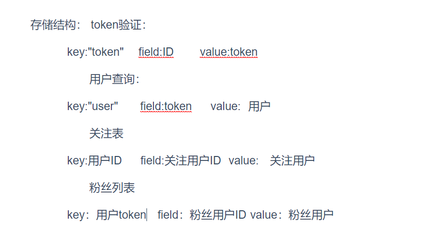

# 第六届字节跳动青训营 - 后端大项目 douyin-demo

## 依赖项

- FFmpeg

Windows:

```shell
winget install FFmpeg
```

## FFmpeg

视频使用了FFmpeg截取了第一秒第一帧作为封面

publish.go

```go
// FFmpeg命令截图
cmd := exec.Command("FFmpeg/ffmpeg.exe", "-i", "public/"+finalName, "-ss" , "1" , "-vframes", "1", "img/"+finalName+".jpg")
err = cmd.Run() //运行
if err != nil {
	fmt.Println(err)
}
```

异步操作对视频进行压缩转码，使得视频适合播放：

```go
func transcodeVideo(finalName string) {
     //视频转码压缩
	cmd := exec.Command("ffmpeg", "-i", "public/"+finalName, "-c:v","libx264", "-crf" ,"23" ,"-preset" ,"medium", "-c:a" ,"aac", "-b:a", "128k" ,"public/"+"new"+finalName)
	err := cmd.Run() //运行
	if err != nil {
		fmt.Println(err)
	}
	os.Remove("public/"+finalName) //移除原文件
	err = os.Rename("public/"+"new"+finalName,"public/"+finalName) //重命名转码文件
	if err != nil {
        fmt.Println("Error renaming file:", err)
        return
    }
```


### 使用Redis实现了关注操作，关注列表，粉丝列表

### 思路

思路是将要传递的user结构体转换成字符串数据存储在redis里，需要使用的时候再取出来。

token验证和查询用户都可以使用Redis优化数据

使用Redis的存储思路如图：



**用用户ID可以访问用户的token进行验证，用户的token可以取出用户本体**

**关注列表用用户的ID作为key，被关注的用户ID作为field，value为关注用户的json数据**

**关注列表用用户的token作为key，粉丝用户ID作为field，value为粉丝用户的json数据**

user.go 在登录和注册的时候将用户数据注册进redis的哈希结构中，用 HSetNX（分布式锁）的方式存储，防止重复操作

## 单元测试

需要Mock的外部依赖：
- 通过GORM框架进行的数据库操作
- Gin框架实现的HTTP请求与响应

### 数据库操作

在各个路由的Handler中，我们经常使用GORM进行数据库操作，因此单元测试需要检验数据库操作是否复合预期。由于GORM在内部拼接SQL语句并发送给数据库处理，我们可以使用 [`go-sqlmock`](https://github.com/DATA-DOG/go-sqlmock) 模拟数据库操作，并对GORM输出给数据库的SQL语句进行检查。

生成模拟的`*sql.DB`连接：
```go
mockDb, mock, err := sqlmock.New()
if err != nil {
t.Fatalf("Failed to create sqlmock: %s", err)
}
defer mockDb.Close()
```

由于被测试的函数通常需要接受一个`*gorm.DB`对象作为参数，或通过`*gin.Context`获取`*gorm.DB`对象，我们需要从模拟的数据库连接构建`*gorm.DB`：
```go
gormDb, err := gorm.Open(mysql.New(mysql.Config{
Conn: mockDb,
}), &gorm.Config{})

if err != nil {
t.Fatalf("Failed to create gorm database: %s", err)
}
```

这个`*gorm.DB`对象可以被传递给被测试的函数用于测试。

### HTTP请求与响应

根据 [Gin 官方文档](https://gin-gonic.com/docs/testing/)，我们可以通过标准库`net/http/httptest`对HTTP请求和响应进行单元测试。

首先需要构建`*gin.Engine`对象并配置需要测试的API路由：
```go
func setupRouter() *gin.Engine {
r := gin.Default()
r.GET("/ping", func(c *gin.Context) {
c.String(200, "pong")
})
return r
}
```

然后使用`net/http`构建测试的HTTP请求，并通过`gin.Engine.ServeHTTP()`模拟接收到的请求：
```go
import (
	"net/http"
	"net/http/httptest"
	"testing"

	"github.com/stretchr/testify/assert"
)

func TestPingRoute(t *testing.T) {
	router := setupRouter()

	w := httptest.NewRecorder()
	req, _ := http.NewRequest("GET", "/ping", nil)
	router.ServeHTTP(w, req)

	assert.Equal(t, 200, w.Code)
	assert.Equal(t, "pong", w.Body.String())
}
```
